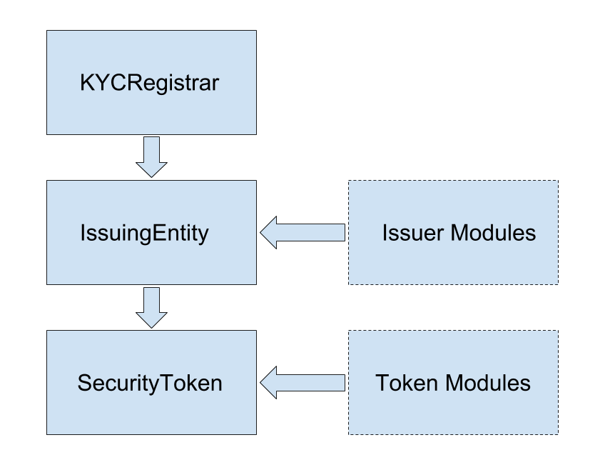

# SFT Token (working title)
One liner.

## Description
__ is a framework of smart contracts that build upon the ERC20 standard to allow for tokenization of equity and debt securities on the ethereum blockchain.  The framework is robust and highly modular and can be used to satisfy regulatory requirements for the complete lifecycle of a security: private and public multi-jurisdictional offerings, secondary trading (OTC, centralised, and decentralised exchanges), blah blah blah...

## How it works
SFT expands upon the ERC20 token standard.  Tokens are transferred via the `transfer` and `transferFrom` methods, however the transfer will only succeed if approved by a series of permissioning modules.  A call to `checkTransfer` returns true if the transfer is possible.  The standard configuration includes checkng a KYC/AML whitelist, tracking investor counts and limits, and restrictions on countries and accreditted status.  By implmenting other modules a variety of additional functionality is possible so as to allow compliance to laws in the countries of the issuer and investors.

## Components

 - [SecurityToken](contracts/SecurityToken.sol)
   - An ERC20 compliant token that represents a claim to ownership of a security
   - Modules may be applied to each security token to add additional permissioning or functionality
 - [IssuingEntity](contracts/IssuingEntity.sol)
   - Represents the company that issues one or more security tokens
   - Modules may be applied at this level that introduce permissioning / functionality to every security token created by the issuer
 - [KYCRegistrar](contracts/KYCRegistrar.sol)
   - The top level permission authority that grants permission for investors, issuers, and exchanges based on off-chain KYC/AML verification

### KYCRegistrar
KYCRegistrar is a central registry contract that establishes the identity, class, and permissions of every address allowed to interact with security tokens. Each permitted address has a bytes32 hash attached to it, that denotes the entity associated to the address.  More than one address may be associated to a single entity.

There are three types of entities:
 1. Investor: Legal persons that have cleared KYC/AML checks and are authorised to hold security tokens. Stored data includes the country, state/province/territory, rating (accreditted, qualified, etc), and expiry date of the authorisation.
 2. Issuers: Legal persons that are authrorised to issue security tokens.
 3. Exchanges: Platforms authorised to facilitate secondary trading of security tokens.

### IssuingEntity
Before an issuer can create security tokens they must deploy an IssuingEntity contract. This contract has several key purposes:

 - Tracks investor counts and total balances across all security tokens deployed by the issuer
 - Enforces permissions relating to investor limits and authorised countries
 - Holds a mapping of hashes for legal documents related to the issuer

Before any security tokens can be sold, an issuer must authorise countries and specify minimum invetor ratings using the `setCountries` method.  Additional restrictions on investor limits can be specified with `setInvestorLimits` and `setCountryInvestorLimits`.

### SecurityToken
SecurityToken represents a single, fungible class of securities from an issuer. It conforms to the ERC20 standard, with an additional `checkTransfer` method available to verify if a transfer will succeed.  Before tokens can be transferred, all of the following checks must pass:

 - Issuer limits on investor counts: global, country specific, and accreditation rating specific
 - Sender, receiver, and issuer addresses must be validated by the KYC registrar
 - Optional permissions added via modules applied at the SecurityToken and IssuingEntity level
 
Transfers that move tokens between different wallets owned by the same entity (as identified in the KYC registrar) are not as heavily restricted because there is no change of ownership.  Any address belonging to a single entity can call `transferFrom` and move tokens from any of their wallets.  The issuer can use the same function to move any tokens between any address.
 

### Modules
Modules attach to IssuingEntity or SecurityToken via the `attachModule` method.  When a module is attached, a call to `getBindings` checks the hook points that the module should be called at.  Depending on the functionality of the module it should contain some or all of these functions:

 - `checkTransfer`: called to verify permissions before a transfer is allowed
 - `transferTokens`: called after a transfer has completed successfully
 - `balanceChanged`: called after a balance has changed, such that there was not a corresponding change to another balance (e.g. token minting and burning)
 
The flow in any of these actions is SecurityToken > SecurityToken modules > IssuingEntity > IssuingEntity modules.

Modules can also call a `modifyBalance` method to change the balance of any address. This will also modify the totalSupply and trigger a call to `balanceChanged`.  Modules that are active at the IssuingEntity level can call this method on any security token, modules at the SecurityToken level can only call it on the token they are attached to.

Modules can be removed via the `detachModule` method. They should only be included when they are required so as to minimize gas costs around a transfer.

Because of the wide range of functionality that modules can hook into, many different applications are possible through them.  Some examples include: dividend payment, voting rights, country/time based token locks, centralised and decentralised exchanges.
