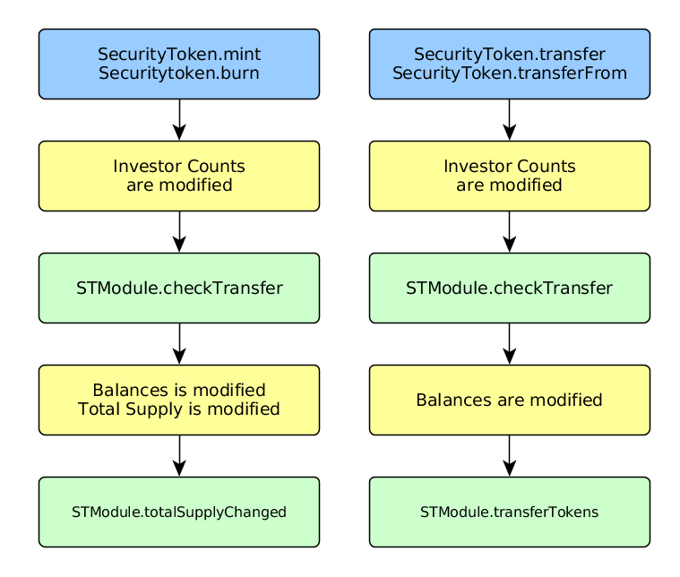
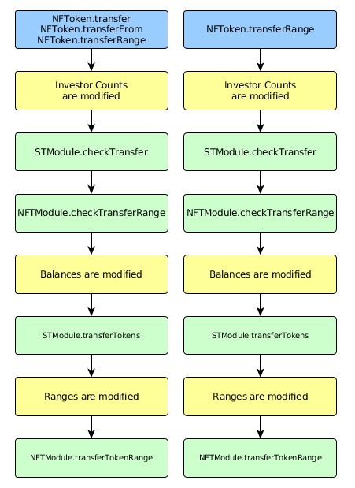

.. _modules:

#######
Modules
#######

Modules are contracts that hook into various methods in :ref:`token` and :ref:`custodian` contracts. They may be used to add custom permissioning logic or extra functionality.

Modules introduce functionality in two ways:

* **Permissions** are methods within the parent contract that the module is able to call into. This can allow actions such as adjusting investor limits, transferring tokens, or changing the total supply.
* **Hooks** are points within the parent contract's methods where the module will be called. They can be used to introduce extra permissioning requirements or record additional data.

In short: hooks involve calls from a parent contract into a module, permissions involve calls from a module into the parent contract.

It may be useful to view source code for the following contracts while reading this document:

* `Modular.sol <https://github.com/HyperLink-Technology/SFT-Protocol/tree/master/contracts/bases/Modular.sol>`__: Inherited by modular contracts. Provides functionality around attaching, detaching, and calling modules.
* `Module.sol <https://github.com/HyperLink-Technology/SFT-Protocol/tree/master/contracts/modules/bases/Module.sol>`__: Inherited by modules. Provide required functionality for modules to be able to attach or detach.
* `IModules.sol <https://github.com/HyperLink-Technology/SFT-Protocol/tree/master/contracts/interfaces/IModules.sol>`__: Interfaces outlining standard module functionality. Includes inputs for all possible hook methods.

.. note:: In order to minimize gas costs, modules should be attached only when their functionality is required and detached as soon as they are no longer needed.

.. warning:: Depending on the hook and permission settings, modules may be capable of actions such as blocking transfers, moving investor tokens and altering the total supply. Only attach a module that has been properly auditted, ensure you understand exactly what it does, and be **very** wary of any module that requires permissions outside of it's documented behaviour.

Attaching and Detaching
=======================

Modules are attached or detached via the ``attachModule`` and ``detachModule`` methods. For :ref:`custodian` modules this method is available within ``OwnedCustodian``, for token modules it is called via the associated ``IssuingEntity`` contract.

Ownership
---------

Each module has an owner which is typically set during deployment.  If the owner is set as an ``IssuingEntity`` contract, it may be attached to every token associated with that issuer. In this way a single module can add functionality or permissioning to many tokens.

.. method:: ModuleBase.getOwner()

    Returns the address of the parent contract that the module is owned by.

Declaring Hooks and Permissions
-------------------------------

Hooks and permissions are set the first time a module is attached by calling the following method:

.. method:: ModuleBase.getPermissions()

    Returns the following:

    * ``permissions``: ``bytes4`` array of method signatures within the parent contract that the module is permitted to call.
    * ``hooks``: ``bytes4`` array of method signatures within the module that the parent contract may call into.
    * ``hookBools``: A ``uint256`` bit field. The first 128 bits set if each hook is active initially, the second half sets if each hook should be always called. See :ref:`modules_bitfields`.

Before attaching a module, be sure to check the return value of this function and compare the requested hook points and permissions to those that would be required for the documented functionality of the module. For example, a module intended to block token transfers should not require permission to mint new tokens.

.. _modules_bitfields:

Bit Fields
**********

Solidity uses 8 bits to store a boolean, however only 1 bit is required. To maximize gas efficiency when handling many booleans at once, ``ModuleBase`` uses `bit fields <https://en.wikipedia.org/wiki/Bit_field>`_.

This functionality is mostly handled within internal methods and not user-facing, with one notable exception: in ``ModuleBase.getPermissions`` the return value ``hookBools`` is a set of 2 x 128 byte bit fields given as a single ``uint256``. The first determines if each hook is active initially, the second if the hook method should always be called when it is active.

Each bit field is read **right to left**.

For example: suppose you have declared four hook points for a module. The first, third and fourth should be active initially. The third should always called when active.

Written left to right, the two bit fields will look like:

.. code-block:: python

    active = "1011"
    always = "0010"

Now we must reverse them, and left-pad with zeros to 128 bits:

.. code-block:: python

    >>> active = active[::-1].zfill(128)
    >>> print(active)
    00000000000000000000000000000000000000000000000000000000000000000000000000000000000000000000000000000000000000000000000000001101
    >>>
    >>> always = always[::-1].zfill(128)
    >>> print(always)
    00000000000000000000000000000000000000000000000000000000000000000000000000000000000000000000000000000000000000000000000000000100

Finally we join the two strings, and then convert the value from binary to decimal:

.. code-block:: python

    >>> final = active + always
    >>> int(final, 2)
    4423670769972200025023869896612986748932

The following python function can be used to quickly convert two boolean lists into a uint256 to be used as ``hookBools``:

.. code-block:: python

    def generate_bitfield(active: list, always: list) -> int:
        assert len(active) == len(always)
        assert len(active) <= 128
        active = "".join("1" if i else "0" for i in active[::-1]).zfill(128)
        always = "".join("1" if i else "0" for i in always[::-1]).zfill(128)
        return int(active + always, 2)

.. note:: If all your hooks are to be active initially and always called, the simplest approach is to set ``hookBool = uint256(-1)``. Underflowing uint256 in this way results in 256 bits set to 1.

Checking Active Modules
-----------------------

The following getter is available in the parent contract, to check if a module is currently active:

.. method:: Modular.isActiveModule(address _module)

    Returns ``true`` if a module is currently active on the contract.

Permissioning
=============

**Permissions** are methods within the parent contract that the module is able to call into. This can allow actions such as adjusting investor limits, transferring tokens, or changing the total supply.

Once attached, modules may call into methods in the parent contract where they have been given permission.

Checking Permissions
--------------------

Any call from a module to a function within the parent contract must first pass a check by this method:

.. method:: Modular.isPermittedModule(address _module, bytes4 _sig)

    Returns ``true`` if a module is active on the contract, and permitted to call the given method signature. Returns ``false`` if not permitted.

Callable Parent Methods
-----------------------

Modules may be permitted to call the following parent methods:

.. note:: When a module calls into the parent contract, it will still trigger any of it's own hooked in methods. With poor contract design you can create infinite loops and effectively break the parent contract functionality as long as the module remains attached.

SecurityToken
*************

.. method:: SecurityToken.transferFrom(address _from, address _to, uint256 _value)

    * Permission signature: ``0x23b872dd``

    Transfers tokens between two addresses. A module calling ``SecurityToken.transferFrom`` has the same level of authority as if the call was from the issuer.

    Calling this method will also call any hooked in ``STModule.checkTransfer``, ``IssuerModule.checkTransfer``, and ``STModule.transferTokens`` methods.

.. method:: TokenBase.modifyAuthorizedSupply(uint256 _value)

    * Permission signature: ``0xc39f42ed``

    Modifies the authorized supply.

    Calling this method will also call any hooked in ``STModule.modifyAuthorizedSupply`` methods.

.. method:: SecurityToken.mint(address _owner, uint256 _value)

    * Permission signature: ``0x40c10f19``

    Mints new tokens to the given address.

    Calling this method will also call any hooked in ``STModule.totalSupplyChanged`` and ``IssuerModule.tokenTotalSupplyChanged`` methods.

.. method:: SecurityToken.burn(address _owner, uint256 _value)

    * Permission signature: ``0x9dc29fac``

    Burns tokens at the given address.

    Calling this method will also call any hooked in ``STModule.totalSupplyChanged`` and ``IssuerModule.tokenTotalSupplyChanged`` methods.

.. method:: TokenBase.detachModule(address _module)

    * Permission signature: ``0xbb2a8522``

    Detaches a module. This method can only be called directly by a permitted module. For the issuer to detach a SecurityToken level module the call must be made via the ``IssuingEntity`` contract.

NFToken
*******

.. method:: NFToken.transferFrom(address _from, address _to, uint256 _value)

    * Permission signature: ``0x23b872dd``

    Transfers tokens between two addresses. A module calling ``NFToken.transferFrom`` has the same level of authority as if the call was from the issuer.

    Calling this method will also call any hooked in ``NFTModule.checkTransfer``, ``IssuerModule.checkTransfer``, and ``NFTModule.transferTokens`` methods.

.. method:: TokenBase.modifyAuthorizedSupply(uint256 _value)

    * Permission signature: ``0xc39f42ed``

    Modifies the authorized supply.

    Calling this method will also call any hooked in ``NFTModule.modifyAuthorizedSupply`` methods.

.. method:: NFToken.mint(address _owner, uint48 _value, uint32 _time, bytes2 _tag)

    * Permission signature: ``0x15077ec8``

    Mints new tokens to the given address.

    Calling this method will also call any hooked in ``NFTModule.totalSupplyChanged`` and ``IssuerModule.tokenTotalSupplyChanged`` methods.

.. method:: NFToken.burn(uint48 _start, uint48 _stop)

    * Permission signature: ``0x9a0d378b``

    Burns tokens at the given address.

    Calling this method will also call any hooked in ``NFTModule.totalSupplyChanged`` and ``IssuerModule.tokenTotalSupplyChanged`` methods.

.. method:: NFToken.modifyRange(uint48 _pointer, uint32 _time, bytes2 _tag)

    * Permission signature: ``0x712a516a``

    Modifies the time restriction and tag for a single range.

.. method:: NFToken.modifyRanges(uint48 _start, uint48 _stop, uint32 _time, bytes2 _tag)

    * Permission signature: ``0x786500aa``

    Modifies the time restriction and tag for all tokens within a given range.

.. method:: TokenBase.detachModule(address _module)

    * Permission signature: ``0xbb2a8522``

    Detaches a module. This method can only be called directly by a permitted module, for the issuer to detach a SecurityToken level module the call must be made via the ``IssuingEntity`` contract.

Custodian
*********

See :ref:`custodian` for more detailed information on these methods.

.. method:: OwnedCustodian.transfer(address _token, address _to, uint256 _value)

    * Permission signature: ``0xbeabacc8``

    Transfers tokens from the custodian to an investor.

    Calling this method will also call any hooked in ``CustodianModule.sentTokens`` methods.

.. method:: OwnedCustodian.transferInternal(address _token, address _from, address _to, uint256 _value)

    * Permission signature: ``0x2f98a4c3``

    Transfers the ownership of tokens between investors within the Custodian contract.

    Calling this method will also call any hooked in ``CustodianModule.internalTransfer`` methods.

.. method:: OwnedCustodian.detachModule(address _module)

    * Permission signature: ``0xbb2a8522``

    Detaches a module.

.. _modules-hooks-tags:

Hooks and Tags
==============

* **Hooks** are points within the parent contract's methods where the module will be called. They can be used to introduce extra permissioning requirements or record additional data.
* **Tags** are ``bytes2`` values attached to token ranges in ``NFToken``, that allow for more granular hook attachments.

Hooks and tags are defined in the following struct:

::

    struct Hook {
        uint256[256] tagBools;
        bool permitted;
        bool active;
        bool always;
    }

* ``tagBools``: An bit field of length ``2^16``. Defines granular hook points based on specific tags.
* ``permitted``: Can only be set the first time the module is attached. If ``true``, this is an available hook point for the module.
* ``active``: Set during attachment, can be modified by the module. If ``true``, this hook is currently active and will be called during the execution of the parent module.
* ``always``: Set during attachment, can be modified by the module. If ``true``, this hook is always called regardless of the tag value.

Hooks involving tokens from an ``NFToken`` contract rely upon tags to determine if the hook point should be called.  A tag is a ``bytes2`` that is assigned to a specific range of tokens.  When a hook point involves a tagged token range, the following three conditions are evaluated to see if the hook method should be called:

* Is ``Hook.always`` set to ``true``?
* Is the first byte of the tag, followed by '00', set to true within ``Hook.tagBools``?
* Is the entire tag set to true within ``Hook.tagBools``?

For example, if the tag is ``0xff32``, the hook point will be called if either ``Hook.always``, ``Hook.tagBools[0xff00]``, or ``Hook.tagBools[0xff32]`` are ``true``.

For hook points that do not involve tags, the module should set ``active`` and ``always`` to true when it wishes to be called.

Setting and Modifying
---------------------

Modules can be designed to modify their own active hook points and tag settings as they progress through different stages of functionality. Avoiding unnecessary external calls from hook points to modules that are no longer relevent helps keep gas costs down.

The following methods are used to modify hook and tag settings. These methods may only be called from the module while it is active.

.. method:: Modular.setHook(bytes4 _sig, bool _active, bool _always)

    Enables or disables a hook point for an active module.

    * ``_sig``: Signature of the hooked method.
    * ``_active``: Boolean for if hooked method is active.
    * ``_always``: Boolean for if hooked method should always be called when active.

.. method:: Modular.setHookTags(bytes4 _sig, bool _value, bytes1 _tagBase, bytes1[] _tags)

    Enables or disables specific tags for a hook point.

    * ``_sig``: Signature of the hooked method.
    * ``_value``: Boolean value to set each tag to.
    * ``_tagBase``: The first byte of the tag to set.
    * ``_tags``: Array of 2nd bytes for the tag.

    For example: if ``_tagBase = 0xff`` and ``_tags = [0x11, 0x22]``, you will modify tags ``0xff00``, ``0xff11``, and ``0xff22``.

.. method:: Modular.clearHookTags(bytes4 _sig, bytes1[] _tagBase)

    Disables many tags for a given hook point.

    * ``_sig``: Signature of the hooked method.
    * ``_tagBase``: Array of first bytes for tags to disable.

    For example: if ``_tagBase = [0xee, 0xff]`` it will clear tags ``0xee00``, ``0xee01`` ... ``0xeeff``, and ``0xff00``, ``0xff01`` ... ``0xffff``.

Hookable Module Methods
-----------------------

The following methods may be included in modules and given as hook points via ``getPermissions``.

Inputs and outputs of all hook points are also defined in `IModules.sol <https://github.com/HyperLink-Technology/SFT-Protocol/tree/master/contracts/interfaces/IModules.sol>`__. This can be a useful starting point when writing your own modules.

SecurityToken
*************

.. method:: STModule.checkTransfer(address[2] _addr, bytes32 _authID, bytes32[2] _id, uint8[2] _rating, uint16[2] _country, uint256 _value)

    * Hook signature: ``0x70aaf928``

    Called by ``SecurityToken.checkTransfer`` to verify if a transfer is permitted.

    * ``_addr``: Sender and receiver addresses.
    * ``_authID``: ID of the authority who wishes to perform the transfer. It may differ from the sender ID if the check is being performed prior to a ``transferFrom`` call.
    * ``_id``: Sender and receiver IDs.
    * ``_rating``: Sender and receiver investor ratings.
    * ``_country``: Sender and receiver countriy codes.
    * ``_value``: Amount to be transferred.

.. method:: STModule.transferTokens(address[2] _addr, bytes32[2] _id, uint8[2] _rating, uint16[2] _country, uint256 _value)

    * Hook signature: ``0x35a341da``

    Called after a token transfer has completed successfully with ``SecurityToken.transfer`` or ``SecurityToken.transferFrom``.

    * ``_addr``: Sender and receiver addresses.
    * ``_id``: Sender and receiver IDs.
    * ``_rating``: Sender and receiver investor ratings.
    * ``_country``: Sender and receiver country codes.
    * ``_value``: Amount that was transferred.

.. method:: STModule.transferTokensCustodian(address _custodian, bytes32[2] _id, uint8[2] _rating, uint16[2] _country, uint256 _value)

    * Hook signature: ``0x8b5f1240``

    Called after an internal custodian token transfer has completed with ``Custodian.transferInternal``.

    * ``_custodian``: Address of the custodian contract.
    * ``_id``: Sender and receiver IDs.
    * ``_rating``: Sender and receiver investor ratings.
    * ``_country``: Sender and receiver country codes.
    * ``_value``: Amount that was transferred.

.. method:: STModule.modifyAuthorizedSupply(uint256 _oldSupply, uint256 _newSupply)

    * Hook signature: ``0xa5f502c1``

    Called before changing the authorized supply of a token.

    * ``_oldSupply``: Current authorized supply
    * ``_newSupply``: New authorized supply

.. method:: STModule.totalSupplyChanged(address _addr, bytes32 _id, uint8 _rating, uint16 _country, uint256 _old, uint256 _new)

    * Hook signature: ``0x741b5078``

    Called after the total supply has been modified by ``SecurityToken.mint`` or ``SecurityToken.burn``.

    * ``_addr``: Address where balance has changed.
    * ``_id``: ID that the address is associated to.
    * ``_rating``: Investor rating.
    * ``_country``: Investor country code.
    * ``_old``: Previous token balance at the address.
    * ``_new``: New token balance at the address.

NFToken
*******

``NFToken`` contracts also include all the hook points for ``SecurityToken``.

Hook points that are unique to ``NFToken`` also perform a check against the tag of the related range before calling to a module.

.. method:: NFTModule.checkTransferRange(address[2] _addr, bytes32 _authID, bytes32[2] _id, uint8[2] _rating, uint16[2] _country, uint48[2] _range)

    * Hook signature: ``0x2d79c6d7``

    Called by ``NFToken.checkTransfer`` and ``NFToken.transferRange`` to verify if the transfer of a specific range is permitted.

    * ``_addr``: Sender and receiver addresses.
    * ``_authID``: ID of the authority who wishes to perform the transfer. It may differ from the sender ID if the check is being performed prior to a ``transferFrom`` call.
    * ``_id``: Sender and receiver IDs.
    * ``_rating``: Sender and receiver investor ratings.
    * ``_country``: Sender and receiver countriy codes.
    * ``_range``: Start and stop index of token range.

.. method:: NFTModule.transferTokenRange(address[2] _addr, bytes32[2] _id, uint8[2] _rating, uint16[2] _country, uint48[2] _range)

    * Hook signature: ``0xead529f5``

    Called after a token range has been transferred successfully with ``NFToken.transfer`, ``NFToken.transferFrom`` or ``NFToken.transferRange``.

    * ``_addr``: Sender and receiver addresses.
    * ``_id``: Sender and receiver IDs.
    * ``_rating``: Sender and receiver investor ratings.
    * ``_country``: Sender and receiver countriy codes.
    * ``_range``: Start and stop index of token range.

Custodian
*********

.. method:: CustodianModule.sentTokens(address _token, address _to, uint256 _value)

    * Hook signature: ``0xb4684410``

    Called after tokens have been transferred out of a Custodian via ``Custodian.transfer``.

    * ``_token``: Address of token that was sent.
    * ``_to``: Address of the recipient.
    * ``_value``: Number of tokens that were sent.

.. method:: CustodianModule.receivedTokens(address _token, address _from, uint256 _value)

    * Hook signature: ``0xb15bcbc4``

    Called after a tokens have been transferred into a Custodian.

    * ``_token``: Address of token that was received.
    * ``_from``: Address of the sender.
    * ``_value``: Number of tokens that were received.

.. method:: CustodianModule.internalTransfer(address _token, address _from, address _to, uint256 _value)

    * Hook signature: ``0x44a29e2a``

    Called after an internal transfer of ownership within the Custodian contract via ``Custodian.transferInternal``.

    * ``_token``: Address of token that was received.
    * ``_from``: Address of the sender.
    * ``_to``: Address of the recipient.
    * ``_value``: Number of tokens that were received.

Module Execution Flows
======================

The following diagrams show the sequence in which modules are called during some of the more complex methods.

    SecurityToken

    NFToken

Events
======

Contracts that include modular functionality have the following events:

.. method:: Modular.ModuleAttached(address module, bytes4[] hooks, bytes4[] permissions)

    Emitted whenever a module is attached with ``Modular.attachModule``.

.. method:: Modular.ModuleHookSet(address module, bytes4 hook, bool active, bool always)

    Emitted once for each hook that is set when a module is attached with ``Modular.attachModule``.

.. method:: Modular.ModuleDetached(address module)

    Emitted when a module is detached with ``Modular.detachModule``.

Use Cases
=========

The wide range of functionality that modules can hook into and access allows for many different applications. Some examples include: crowdsales, country/time based token locks, right of first refusal enforcement, voting rights, dividend payments, tender offers, and bond redemption.

We have included some sample modules on `GitHub <https://github.com/HyperLink-Technology/SFT-Protocol/tree/master/contracts/modules>`__ as examples to help understand module development and demonstrate the range of available functionality.
